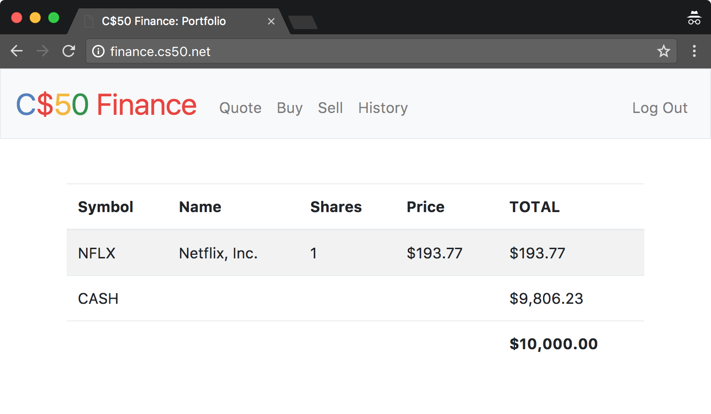

# CS50_FinanceApp
Open Source finance app

A virtual stock trading web app built with Python (Flask/Jinja2), SQLite3 (local), and Bootstrap, deployed to Heroku. Stock prices from IEX API.

Functionalities:

- Log in/Register: Create and log in to an account
- Quote: Query stock price
- Buy: Buy shares of stock
- Sell: Sell shares of stock
- History: View transaction history
- Password: Change password for user
